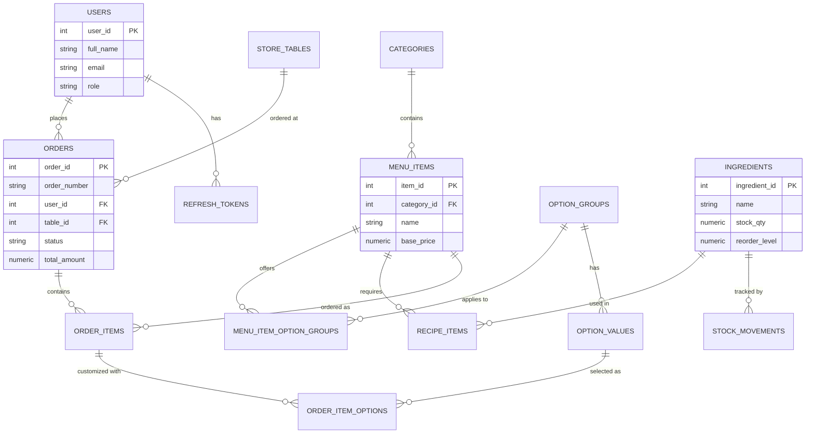

# Entity-Relationship Diagram

Render this with any Mermaid-compatible viewer (GitHub renders it natively, or use
https://mermaid.live). The authoritative source of truth for structure/constraints is
`database/schema.sql`.
